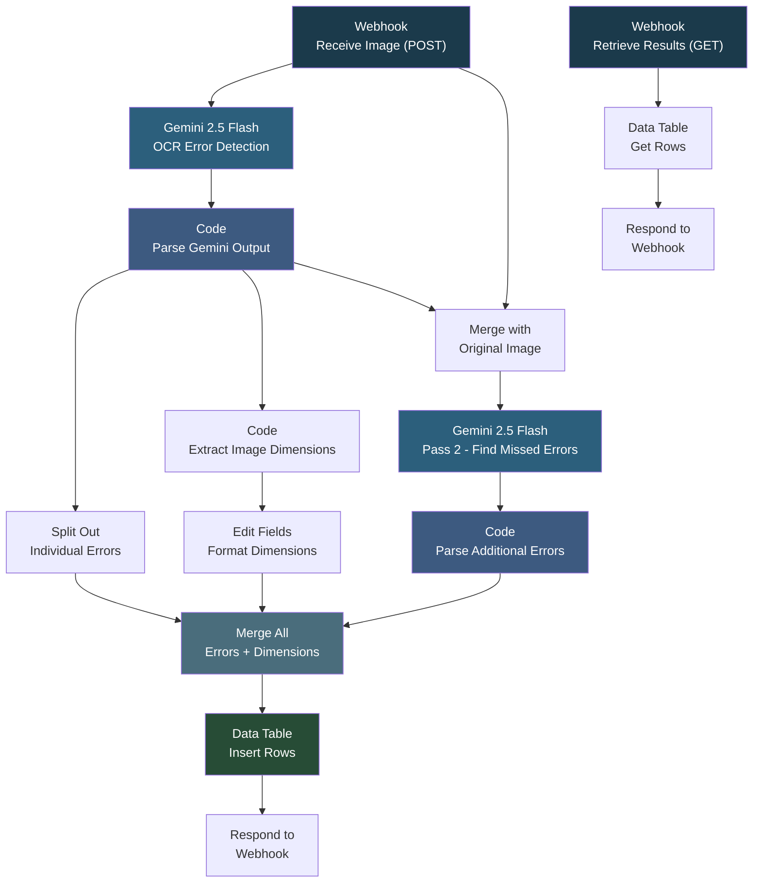

# Image Lens Pro - Duplicate

## Overview

This workflow provides an automated packaging quality control system that detects text errors on product packaging images. It uses a multi-model AI approach - first running Google Gemini for deep OCR error detection, then passing the results to a second Gemini pass (with GPT-4o available as an alternative) to catch anything the first model missed. The combined errors are stored in an n8n data table and returned via webhook, making it easy to integrate with a front-end review application. It is designed for high-stakes packaging where missed errors are costly.

## How It Works

```
Webhook (POST with image) -> Gemini OCR Pass 1 (detect errors + coordinates) -> Parse and clean results -> Gemini Pass 2 (find missed errors) -> Parse additional errors -> Merge all errors + metadata -> Store in Data Table -> Respond with results
```

A separate webhook endpoint allows retrieving stored results from the data table at any time.

### Workflow Diagram



### Workflow Steps

1. **Webhook (POST)** - Receives a packaging image as binary data from the front-end application.
2. **Gemini Pass 1** - Analyzes the image for spelling errors, compound word issues, missing characters, OCR confusion, and grammar mistakes. Returns errors with coordinates, confidence levels, and panel zones.
3. **Parse Gemini Output** - Cleans the JSON response, extracts the errors array, and prepares data for the second pass.
4. **Split and Extract** - Splits individual errors for merging and extracts image dimension metadata.
5. **Gemini Pass 2** - Re-analyzes the image with knowledge of Pass 1 findings, looking specifically for errors the first pass missed (spacing, trademarks, formatting, consistency).
6. **Parse Additional Errors** - Extracts the second model's findings into the same normalized format.
7. **Merge Results** - Combines errors from both passes along with image dimensions into a unified result set.
8. **Store Results** - Inserts all error records into an n8n data table for persistence.
9. **Return Response** - Sends the results back to the calling application.
10. **Retrieval Endpoint** - A separate GET webhook reads stored results from the data table on demand.

## Nodes

| Node | Type |
|------|------|
| Webhook1 (POST) | Webhook (receive image) |
| Zonal OCR (The Technician)1 | Google Gemini (Pass 1) |
| Code in JavaScript4 | Code (parse Gemini output) |
| Split Out | Split Out (individual errors) |
| Code in JavaScript | Code (extract dimensions) |
| Edit Fields | Set (format dimensions) |
| Merge3 | Merge (image + Gemini results) |
| Zonal OCR (The Technician) | Google Gemini (Pass 2) |
| Code in JavaScript5 | Code (parse Pass 2 errors) |
| Merge2 | Merge (all errors + dimensions) |
| Insert row | Data Table (store errors) |
| Respond to Webhook1 | Respond to Webhook |
| Webhook (GET) | Webhook (retrieve results) |
| Get row(s) | Data Table (read errors) |
| Respond to Webhook | Respond to Webhook |

## Integrations

- **Google Gemini (2.5 Flash)** - Primary and secondary OCR error detection with coordinate mapping
- **OpenAI (GPT-4o)** - Available as an alternative second-pass model (currently disabled)
- **n8n Data Table** - Persistent storage for detected errors

## Setup

1. Import `Image_Lens_Pro_Duplicate.json` into your n8n instance.
2. Configure credentials for Google Gemini (PaLM API).
3. Optionally configure OpenAI credentials if you want to enable the GPT-4o second pass instead of Gemini.
4. Create the n8n data table "OCR_errors" with columns: error_id, found_text, corrected_text, error_type, issue_description, confidence, panel_zone, timestamp.
5. Update the webhook allowed origins to match your front-end application URL.
6. Activate the workflow.
